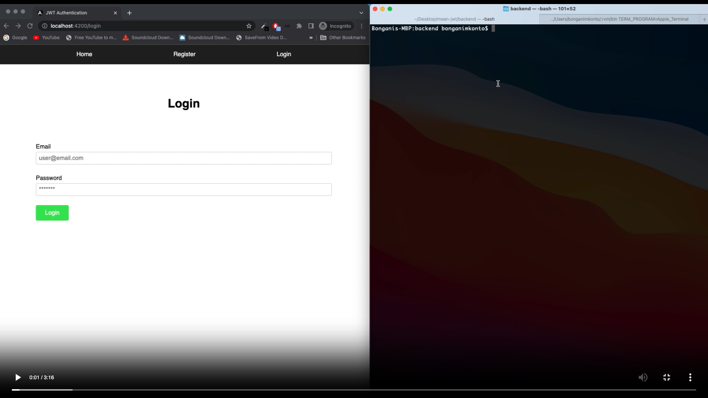
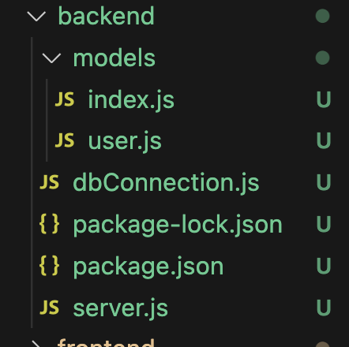
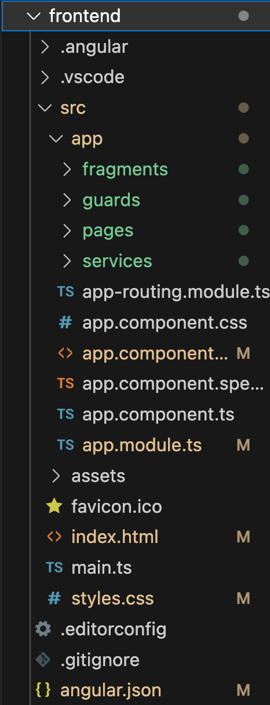

# Angular JWT Prototype
This code serves as a prototype code that will be used to develop future applications. The authentication works but is still a bit rough. However, as my understanding of Angular/Express/MongoDB increases, improvements will be bound to happen.

## Video Demonstration

* Use the following <a href="https://host.phylls.org/videos/Angular-JWT-prototype-code.mp4" target="_blank">video link</a> to view the application is operation.

## Backend Dependencies/Packages
* bcrypt
* cookie-parser
* cors
* express
* jsonwebtoken
* mongoose
* nodemon

## Backend Infrastructure
* The backend file structure.


### Backend Files Explained
- The user.js model houses the Mongoose Schema that allows us to save a new user model when we received post data.
- The dbConnection.js establishes a connection to the MongoDB.
- The server.js file is the meaty part which handles the bcrypt hash encryption, cors(), app routes for POST and GET methods and initializes the server.

## Frontend Infrastructure
* The frontend file structure


### Frontend Files Explained
- The fragments/ folder contains the components like the header and footer.
- The guards/ folder contains the AuthGuard which uses canActivate() method to guard routes in app.module.ts.
- The pages/ folder contains all the other components like dashboard,home, login, logout, myaccount and register.
- The services/ folder contains the service file which handles the HTTP requests between the register/login forms and the express server. 

### Key takeaways that I learnt in this experiment
- In order to obtain a consistent stream of data for the httpOnly assigned JWT cookie, I needed to pass { withCredentials: true } in my http post/get methods. Without this, I could not verify and get the req.cookies.cookiename token in my /verify-token route.
```typescript
this.http.post(`${this.API_URL}/${uri}`, data, { withCredentials: true }).subscribe((response: any) => {
    // code goes here
});

this.http.get(`${this.API_URL}/logout`, { withCredentials: true }).subscribe((response: any) => {
    // code goes here
});

this.http.get(`${this.API_URL}/verify-token`, { withCredentials: true }).subscribe((response: any) => {
    // code goes here
});
```

This is then accepted in the cors() method implemented in the server.js file in the backend/folder
```javascript
app.use(cors({
    origin: ['http://localhost:4200'],
    credentials: true,
    methods: ['GET','POST','PUT','DELETE']
}));
```

- EventEmitters are extremely handy especially if you want to get the state of your app when you login/logout
- As long as your authentication code is true, you can guard routes by simply doing the following
```typescript
  { path: 'dashboard', component: DashboardComponent, canActivate: [AuthGuard] },
```